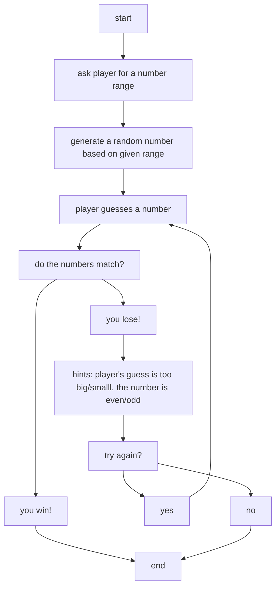
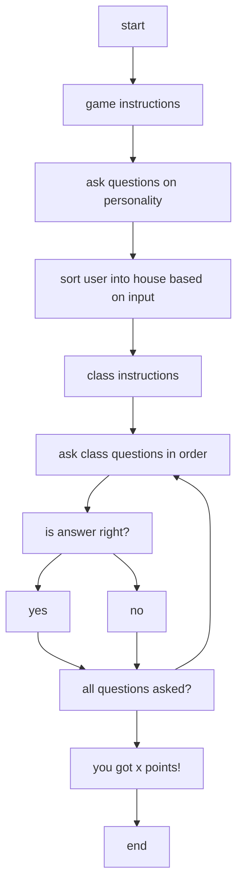

CIF Junior
---
Introduction
---
Coding Is Fun (CIF) is an organization that offers virtual classes to teach students python. There are three levels: beginner, junior, and senior. In every class, there are teachers that share their knowledge, and guide students through the different steps. There are also many peers to share ideas and learn with together. It is a friendly learning process that can help with future aspirations.

CIF Junior classes cover the following:
-  Python
-  Markdown
-  Mermaid
-  C++
-  Html
-  Javascript

and more!

In the duration of 20 units, with 20 classes, six projects are created by the students. 

Project 1
---
During classes two and three, we learned how to create number guessing games. The player would give the number range they wanted to guess in, and the system would randomly generate one. There are also hints that are given if the player is having a hard time.

Here is the flowchart of my number guessing game: 

You can also find my code of my number guessing game on my CIF repository under "unit 3". 

Poject 2
---
During classes three and four, we learned how to make a text based adventure game (TBAG). There would be questions asked to the player, and if they answered correctly, they would get points! Many different variations of these games were taught, and I created a Harry Potter themed one. The player would be sorted into their house, and then participate in a class, and be tested on the material afterwards. 

Here is the flowchart of my game: 

You can also find my code of my number guessing game on my CIF repository under "unit 5". 

Project 3
---
During classes six and seven, our goal was to create a turtle firework drawing for our project. We could use different colours to make the fireworks, the backrgound, and the other little details more vibrant and prettier. Instead of the usual patterns normal fireworks make, we were encouraged to create our own unique and creative patterns, using the codes we were taught. 

Here is the firework I created: 

You can also find the picture and the code of my firework on my CIF repository under "unit 7".

Other
---
more to come soon!

Links
---
CIF: https://www.itisfun.org/

Medium: https://medium.com/@chloe.m.ha
